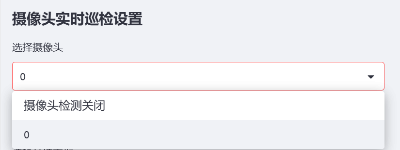

# 水果成熟度检测检测系统源码分享
 # [一条龙教学YOLOV8标注好的数据集一键训练_70+全套改进创新点发刊_Web前端展示]

### 1.研究背景与意义

项目参考[AAAI Association for the Advancement of Artificial Intelligence](https://gitee.com/qunshansj/projects)

项目来源[AACV Association for the Advancement of Computer Vision](https://gitee.com/qunmasj/projects)

研究背景与意义

随着全球人口的不断增长和生活水平的提高，水果作为重要的营养来源，其市场需求日益增加。然而，水果的成熟度直接影响其口感、营养价值和市场价格，因此，准确判断水果的成熟度显得尤为重要。传统的水果成熟度检测方法多依赖于人工经验，不仅效率低下，而且容易受到主观因素的影响，导致检测结果的不一致性。近年来，计算机视觉和深度学习技术的快速发展为水果成熟度检测提供了新的解决方案，尤其是基于卷积神经网络（CNN）的目标检测模型在图像识别领域展现出了卓越的性能。

YOLO（You Only Look Once）系列模型因其高效的实时检测能力而受到广泛关注。YOLOv8作为该系列的最新版本，进一步优化了检测精度和速度，能够在复杂环境中实现高效的目标检测。通过对YOLOv8进行改进，可以针对水果成熟度检测的特定需求，提升其在实际应用中的表现。具体而言，针对水果的外观特征、光照变化和背景复杂性等因素，改进后的YOLOv8模型能够更好地适应不同成熟度水果的识别任务。

本研究所使用的数据集“jeruk”包含5500张标注图像，涵盖了三种成熟度类别：成熟（Matang）、过熟（Terlalu Matang）和未成熟（object）。这一数据集的构建为水果成熟度检测提供了丰富的样本基础，使得模型能够学习到不同成熟度水果的特征。这些类别的划分不仅有助于提高检测的准确性，也为后续的水果分级和市场营销提供了科学依据。通过对这些图像的深度学习分析，模型将能够识别出水果的成熟状态，进而为消费者提供更为精准的购买建议。

此外，水果成熟度检测系统的研究意义还体现在其广泛的应用前景上。随着农业智能化的推进，基于计算机视觉的成熟度检测系统能够在果园管理、采摘决策、物流运输等环节发挥重要作用。例如，在果园中，农民可以利用该系统实时监测水果的成熟状态，从而优化采摘时间，提高水果的品质和产量。在物流环节，成熟度检测系统可以帮助商家在运输过程中保持水果的新鲜度，减少损耗，提高经济效益。

综上所述，基于改进YOLOv8的水果成熟度检测系统不仅能够提升检测效率和准确性，还为农业生产和市场流通提供了新的技术支持。通过本研究的深入探索，将为水果产业的智能化发展贡献一份力量，推动农业与科技的深度融合，促进可持续发展目标的实现。

### 2.图片演示


##### 注意：由于此博客编辑较早，上面“2.图片演示”和“3.视频演示”展示的系统图片或者视频可能为老版本，新版本在老版本的基础上升级如下：（实际效果以升级的新版本为准）

  （1）适配了YOLOV8的“目标检测”模型和“实例分割”模型，通过加载相应的权重（.pt）文件即可自适应加载模型。

  （2）支持“图片识别”、“视频识别”、“摄像头实时识别”三种识别模式。

  （3）支持“图片识别”、“视频识别”、“摄像头实时识别”三种识别结果保存导出，解决手动导出（容易卡顿出现爆内存）存在的问题，识别完自动保存结果并导出到tempDir中。

  （4）支持Web前端系统中的标题、背景图等自定义修改，后面提供修改教程。

  另外本项目提供训练的数据集和训练教程,暂不提供权重文件（best.pt）,需要您按照教程进行训练后实现图片演示和Web前端界面演示的效果。

### 3.视频演示

[3.1 视频演示](https://www.bilibili.com/video/BV1HGt5euEXV/)

### 4.数据集信息展示

##### 4.1 本项目数据集详细数据（类别数＆类别名）

nc: 3
names: ['Matang', 'Terlalu Matang', 'object']


##### 4.2 本项目数据集信息介绍

数据集信息展示

在本研究中，我们采用了名为“jeruk”的数据集，以支持改进YOLOv8的水果成熟度检测系统的训练与评估。该数据集专注于橙子的成熟度分类，具有丰富的样本和多样的图像特征，为模型的训练提供了坚实的基础。数据集的类别数量为三，具体包括“Matang”（成熟）、“Terlalu Matang”（过熟）和“object”（物体），这三类标注为模型提供了清晰的目标，使其能够在实际应用中有效区分不同成熟度的橙子。

“jeruk”数据集的设计考虑到了水果成熟度检测的实际需求，包含了大量不同环境下拍摄的橙子图像。这些图像不仅涵盖了不同的光照条件、背景和拍摄角度，还包括了不同品种和大小的橙子，确保了数据集的多样性和代表性。每个类别的样本数量经过精心挑选，以保证模型在训练过程中能够获得充分的学习信息，进而提高其在真实场景中的泛化能力。

在数据预处理阶段，我们对“jeruk”数据集中的图像进行了标准化处理，包括调整图像尺寸、增强对比度和亮度等，以提高模型的训练效果。此外，数据集还采用了数据增强技术，通过旋转、翻转和缩放等方式生成更多的训练样本，从而进一步丰富了模型的学习数据。这种多样化的训练数据能够有效降低模型的过拟合风险，提高其在新样本上的检测精度。

值得注意的是，数据集中的每个类别都有明确的定义和特征。例如，“Matang”类的橙子通常呈现出鲜艳的橙色，表面光滑且无明显瑕疵；而“Terlalu Matang”类的橙子则可能出现表面变软、颜色暗淡或有腐烂迹象等特征。这些细微的差别为模型的学习提供了丰富的上下文信息，使其能够在实际应用中更准确地判断橙子的成熟度。

通过使用“jeruk”数据集，我们期望能够训练出一个高效的YOLOv8模型，能够实时检测和分类橙子的成熟度。这不仅有助于提高水果的市场价值，还能在农业生产中提供科学依据，帮助农民选择最佳的采摘时机。最终，我们希望通过这一研究，推动水果成熟度检测技术的发展，为农业智能化提供更多的支持和可能性。数据集的构建和应用将为未来的研究提供宝贵的经验和数据基础，助力相关领域的进一步探索与创新。


### 5.全套项目环境部署视频教程（零基础手把手教学）

[5.1 环境部署教程链接（零基础手把手教学）](https://www.ixigua.com/7404473917358506534?logTag=c807d0cbc21c0ef59de5)


[5.2 安装Python虚拟环境创建和依赖库安装视频教程链接（零基础手把手教学）](https://www.ixigua.com/7404474678003106304?logTag=1f1041108cd1f708b01a)

### 6.手把手YOLOV8训练视频教程（零基础小白有手就能学会）

[6.1 手把手YOLOV8训练视频教程（零基础小白有手就能学会）](https://www.ixigua.com/7404477157818401292?logTag=d31a2dfd1983c9668658)

### 7.70+种全套YOLOV8创新点代码加载调参视频教程（一键加载写好的改进模型的配置文件）

[7.1 70+种全套YOLOV8创新点代码加载调参视频教程（一键加载写好的改进模型的配置文件）](https://www.ixigua.com/7404478314661806627?logTag=29066f8288e3f4eea3a4)

### 8.70+种全套YOLOV8创新点原理讲解（非科班也可以轻松写刊发刊，V10版本正在科研待更新）

由于篇幅限制，每个创新点的具体原理讲解就不一一展开，具体见下列网址中的创新点对应子项目的技术原理博客网址【Blog】：


[8.1 70+种全套YOLOV8创新点原理讲解链接](https://gitee.com/qunmasj/good)

### 9.系统功能展示（检测对象为举例，实际内容以本项目数据集为准）

图9.1.系统支持检测结果表格显示

  图9.2.系统支持置信度和IOU阈值手动调节

  图9.3.系统支持自定义加载权重文件best.pt(需要你通过步骤5中训练获得)

  图9.4.系统支持摄像头实时识别

  图9.5.系统支持图片识别

  图9.6.系统支持视频识别

  图9.7.系统支持识别结果文件自动保存

  图9.8.系统支持Excel导出检测结果数据





### 10.原始YOLOV8算法原理

原始YOLOv8算法原理

YOLOv8算法是Ultralytics公司在2023年推出的目标检测领域的最新版本，基于以往YOLO系列的成功经验，进行了全面的优化和创新。YOLOv8的设计理念是快速、准确且易于使用，使其在目标检测、图像分割和图像分类等任务中展现出卓越的性能。其网络结构由主干网络（Backbone）、特征增强网络（Neck）和检测头（Head）三部分组成，整体架构经过精心设计，以提高模型的效率和精度。

在输入层，YOLOv8采用了640x640的默认图像尺寸，但考虑到实际应用中图像长宽比的多样性，算法引入了自适应图片缩放技术。这种技术的核心在于将图像的长边按比例缩小至指定尺寸，然后对短边进行填充，以减少信息冗余，提升目标检测和推理的速度。此外，在训练过程中，YOLOv8使用了Mosaic图像增强操作，通过随机拼接四张不同的图像，生成新的训练样本，增强了模型对不同位置和周围像素的学习能力，从而提高了预测精度。

YOLOv8的主干网络部分在设计上进行了显著改进，采用了C2F模块替代了YOLOv5中的C3模块。C2F模块的设计灵感来源于YOLOv7中的ELAN模块，具有更丰富的梯度流信息。与C3模块相比，C2F模块并行了更多的梯度流分支，确保了在保持轻量化的同时，能够获得更高的精度和更合理的延迟。这种设计使得YOLOv8在特征提取的过程中，能够更有效地捕捉到不同尺度和不同特征的信息。

在特征增强网络部分，YOLOv8采用了PAN-FPN的思想，结合了特征金字塔网络和路径聚合网络的优点，以提高特征融合的效率。通过优化特征的传递和融合，YOLOv8能够更好地处理多尺度目标，提高检测的准确性和鲁棒性。特征增强网络的设计旨在将不同层次的特征信息有效整合，从而为后续的目标检测提供更为丰富的特征支持。

YOLOv8的检测头部分是其创新的核心，采用了解耦头（Decoupled Head）结构，取代了YOLOv5中的耦合头（Coupled Head）。这种结构将目标的分类和回归任务分开处理，使得每个任务能够更加专注于自身的目标，从而有效解决复杂场景下的定位不准和分类错误的问题。在解耦头中，输入的特征图首先通过两个1x1的卷积模块进行降维，然后分别生成分类和边界框回归的预测结果。这种解耦设计不仅提高了模型的灵活性，还优化了损失函数的设计，使得模型在训练和推理过程中更加一致。

值得注意的是，YOLOv8摒弃了传统的Anchor-Based（基于锚框）方法，转而采用Anchor-Free（无锚框）的方法。这一创新使得目标检测不再依赖于预设的锚框，而是将目标检测转化为关键点检测，直接预测目标的位置和大小。这种方法的优势在于减少了锚框选择和调整的复杂性，提高了模型的泛化能力，使得YOLOv8能够在不同尺度和形状的目标检测中表现出色。

在损失函数的设计上，YOLOv8同样进行了优化。为了使网络模型能够快速聚焦到标签附近的数值，YOLOv8在边界框回归分支中使用了分布焦点损失（DFL）和CIoU损失。这种损失函数的组合旨在提高模型对目标边界的准确性，使得预测框更接近于实际的边界框区域。

YOLOv8在训练时间和检测精度上都得到了显著提升，模型的权重文件相较于之前的YOLO系列进一步轻量化，使其能够在各种嵌入式设备上高效运行。其快速、高效的性能使得YOLOv8能够满足实时检测的需求，广泛应用于安防监控、自动驾驶、智能制造等多个领域。

总的来说，YOLOv8算法在原有YOLO系列的基础上，通过引入新的网络结构和优化策略，显著提升了目标检测的性能和灵活性。其自适应输入处理、改进的主干网络、特征增强网络以及解耦检测头的设计，使得YOLOv8不仅在精度上有了突破，同时也在计算效率上实现了优化，展现出强大的应用潜力和广泛的适用性。随着YOLOv8的不断发展和应用，目标检测技术将在更多领域发挥重要作用，推动智能视觉技术的进步与创新。


### 11.项目核心源码讲解（再也不用担心看不懂代码逻辑）

#### 11.1 code\ultralytics\trackers\byte_tracker.py

以下是对代码中最核心部分的分析和详细注释：

```python
import numpy as np
from .basetrack import BaseTrack, TrackState
from .utils import matching
from .utils.kalman_filter import KalmanFilterXYAH

class STrack(BaseTrack):
    """
    单个目标跟踪表示，使用卡尔曼滤波进行状态估计。

    该类负责存储与单个跟踪相关的所有信息，并基于卡尔曼滤波进行状态更新和预测。

    属性：
        shared_kalman (KalmanFilterXYAH): 在所有STrack实例中共享的卡尔曼滤波器，用于预测。
        _tlwh (np.ndarray): 私有属性，存储边界框的左上角坐标及宽高。
        kalman_filter (KalmanFilterXYAH): 此对象跟踪的卡尔曼滤波器实例。
        mean (np.ndarray): 状态估计的均值向量。
        covariance (np.ndarray): 状态估计的协方差。
        is_activated (bool): 布尔标志，指示跟踪是否已激活。
        score (float): 跟踪的置信度分数。
        tracklet_len (int): 跟踪段的长度。
        cls (any): 目标的类别标签。
        idx (int): 目标的索引或标识符。
        frame_id (int): 当前帧ID。
        start_frame (int): 目标首次检测到的帧。

    方法：
        predict(): 使用卡尔曼滤波预测目标的下一个状态。
        activate(kalman_filter, frame_id): 激活新的跟踪段。
        update(new_track, frame_id): 更新匹配跟踪的状态。
    """

    shared_kalman = KalmanFilterXYAH()  # 共享的卡尔曼滤波器实例

    def __init__(self, tlwh, score, cls):
        """初始化新的STrack实例。"""
        super().__init__()
        # 将tlwh格式的边界框转换为tlbr格式并存储
        self._tlwh = np.asarray(self.tlbr_to_tlwh(tlwh[:-1]), dtype=np.float32)
        self.kalman_filter = None  # 初始化卡尔曼滤波器为None
        self.mean, self.covariance = None, None  # 初始化均值和协方差为None
        self.is_activated = False  # 跟踪未激活

        self.score = score  # 跟踪的置信度分数
        self.tracklet_len = 0  # 跟踪段长度
        self.cls = cls  # 目标类别
        self.idx = tlwh[-1]  # 目标索引

    def predict(self):
        """使用卡尔曼滤波预测均值和协方差。"""
        mean_state = self.mean.copy()  # 复制当前均值状态
        if self.state != TrackState.Tracked:  # 如果状态不是跟踪状态
            mean_state[7] = 0  # 将速度设置为0
        # 使用卡尔曼滤波器进行预测
        self.mean, self.covariance = self.kalman_filter.predict(mean_state, self.covariance)

    def activate(self, kalman_filter, frame_id):
        """开始新的跟踪段。"""
        self.kalman_filter = kalman_filter  # 设置卡尔曼滤波器
        self.track_id = self.next_id()  # 获取下一个跟踪ID
        # 初始化均值和协方差
        self.mean, self.covariance = self.kalman_filter.initiate(self.convert_coords(self._tlwh))

        self.tracklet_len = 0  # 重置跟踪段长度
        self.state = TrackState.Tracked  # 设置状态为跟踪
        if frame_id == 1:
            self.is_activated = True  # 如果是第一帧，激活跟踪
        self.frame_id = frame_id  # 设置当前帧ID
        self.start_frame = frame_id  # 设置开始帧ID

    def update(self, new_track, frame_id):
        """
        更新匹配跟踪的状态。

        参数：
            new_track (STrack): 包含更新信息的新跟踪。
            frame_id (int): 当前帧的ID。
        """
        self.frame_id = frame_id  # 更新当前帧ID
        self.tracklet_len += 1  # 增加跟踪段长度

        new_tlwh = new_track.tlwh  # 获取新的tlwh格式边界框
        # 使用卡尔曼滤波器更新均值和协方差
        self.mean, self.covariance = self.kalman_filter.update(
            self.mean, self.covariance, self.convert_coords(new_tlwh)
        )
        self.state = TrackState.Tracked  # 设置状态为跟踪
        self.is_activated = True  # 激活跟踪

        self.score = new_track.score  # 更新置信度分数
        self.cls = new_track.cls  # 更新目标类别
        self.idx = new_track.idx  # 更新目标索引

class BYTETracker:
    """
    BYTETracker: 基于YOLOv8的目标检测和跟踪算法。

    该类负责初始化、更新和管理视频序列中检测到的目标的跟踪。它维护跟踪、丢失和移除的状态，
    利用卡尔曼滤波预测新的目标位置，并执行数据关联。

    属性：
        tracked_stracks (list[STrack]): 成功激活的跟踪列表。
        lost_stracks (list[STrack]): 丢失的跟踪列表。
        removed_stracks (list[STrack]): 移除的跟踪列表。
        frame_id (int): 当前帧ID。
        args (namespace): 命令行参数。
        max_time_lost (int): 跟踪被视为“丢失”的最大帧数。
        kalman_filter (object): 卡尔曼滤波器对象。

    方法：
        update(results, img=None): 使用新检测更新对象跟踪器。
        init_track(dets, scores, cls, img=None): 使用检测初始化对象跟踪。
    """

    def __init__(self, args, frame_rate=30):
        """初始化YOLOv8对象以跟踪具有给定参数和帧速率的对象。"""
        self.tracked_stracks = []  # 成功激活的跟踪列表
        self.lost_stracks = []  # 丢失的跟踪列表
        self.removed_stracks = []  # 移除的跟踪列表

        self.frame_id = 0  # 当前帧ID
        self.args = args  # 命令行参数
        self.max_time_lost = int(frame_rate / 30.0 * args.track_buffer)  # 最大丢失时间
        self.kalman_filter = self.get_kalmanfilter()  # 获取卡尔曼滤波器
        self.reset_id()  # 重置ID

    def update(self, results, img=None):
        """使用新检测更新对象跟踪器并返回跟踪对象的边界框。"""
        self.frame_id += 1  # 增加帧ID
        activated_stracks = []  # 激活的跟踪列表
        refind_stracks = []  # 重新找到的跟踪列表
        lost_stracks = []  # 丢失的跟踪列表
        removed_stracks = []  # 移除的跟踪列表

        scores = results.conf  # 获取检测分数
        bboxes = results.xyxy  # 获取边界框
        bboxes = np.concatenate([bboxes, np.arange(len(bboxes)).reshape(-1, 1)], axis=-1)  # 添加索引
        cls = results.cls  # 获取类别

        # 过滤检测结果
        remain_inds = scores > self.args.track_high_thresh  # 高分数检测
        inds_low = scores > self.args.track_low_thresh  # 低分数检测
        inds_high = scores < self.args.track_high_thresh  # 高分数检测

        # 获取第二次检测
        inds_second = np.logical_and(inds_low, inds_high)
        dets_second = bboxes[inds_second]
        dets = bboxes[remain_inds]
        scores_keep = scores[remain_inds]
        cls_keep = cls[remain_inds]

        # 初始化跟踪
        detections = self.init_track(dets, scores_keep, cls_keep, img)
        unconfirmed = []  # 未确认的跟踪
        tracked_stracks = []  # 已跟踪的跟踪列表
        for track in self.tracked_stracks:
            if not track.is_activated:
                unconfirmed.append(track)  # 添加未激活的跟踪
            else:
                tracked_stracks.append(track)  # 添加已激活的跟踪

        # 进行第一次关联
        strack_pool = self.joint_stracks(tracked_stracks, self.lost_stracks)  # 合并跟踪列表
        self.multi_predict(strack_pool)  # 预测当前位置信息

        # 计算距离并进行匹配
        dists = self.get_dists(strack_pool, detections)
        matches, u_track, u_detection = matching.linear_assignment(dists, thresh=self.args.match_thresh)

        # 更新匹配的跟踪
        for itracked, idet in matches:
            track = strack_pool[itracked]
            det = detections[idet]
            if track.state == TrackState.Tracked:
                track.update(det, self.frame_id)  # 更新跟踪
                activated_stracks.append(track)  # 添加到激活列表
            else:
                track.re_activate(det, self.frame_id, new_id=False)  # 重新激活
                refind_stracks.append(track)  # 添加到重新找到的列表

        # 处理未确认的跟踪
        dists = self.get_dists(unconfirmed, detections)
        matches, u_unconfirmed, u_detection = matching.linear_assignment(dists, thresh=0.7)
        for itracked, idet in matches:
            unconfirmed[itracked].update(detections[idet], self.frame_id)  # 更新未确认的跟踪
            activated_stracks.append(unconfirmed[itracked])  # 添加到激活列表

        # 初始化新的跟踪
        for inew in u_detection:
            track = detections[inew]
            if track.score < self.args.new_track_thresh:
                continue
            track.activate(self.kalman_filter, self.frame_id)  # 激活新的跟踪
            activated_stracks.append(track)  # 添加到激活列表

        # 更新状态
        for track in self.lost_stracks:
            if self.frame_id - track.end_frame > self.max_time_lost:
                track.mark_removed()  # 标记为移除
                removed_stracks.append(track)  # 添加到移除列表

        # 更新跟踪状态
        self.tracked_stracks = [t for t in self.tracked_stracks if t.state == TrackState.Tracked]
        self.tracked_stracks = self.joint_stracks(self.tracked_stracks, activated_stracks)
        self.tracked_stracks = self.joint_stracks(self.tracked_stracks, refind_stracks)
        self.lost_stracks = self.sub_stracks(self.lost_stracks, self.tracked_stracks)
        self.lost_stracks.extend(lost_stracks)
        self.lost_stracks = self.sub_stracks(self.lost_stracks, self.removed_stracks)
        self.tracked_stracks, self.lost_stracks = self.remove_duplicate_stracks(self.tracked_stracks, self.lost_stracks)
        self.removed_stracks.extend(removed_stracks)

        return np.asarray(
            [x.tlbr.tolist() + [x.track_id, x.score, x.cls, x.idx] for x in self.tracked_stracks if x.is_activated],
            dtype=np.float32,
        )

    def init_track(self, dets, scores, cls, img=None):
        """使用检测和分数初始化对象跟踪。"""
        return [STrack(xyxy, s, c) for (xyxy, s, c) in zip(dets, scores, cls)] if len(dets) else []  # 检测结果

    def get_dists(self, tracks, detections):
        """计算跟踪和检测之间的距离。"""
        dists = matching.iou_distance(tracks, detections)  # 计算IOU距离
        dists = matching.fuse_score(dists, detections)  # 融合分数
        return dists

    def multi_predict(self, tracks):
        """返回使用YOLOv8网络预测的跟踪。"""
        STrack.multi_predict(tracks)

    @staticmethod
    def joint_stracks(tlista, tlistb):
        """将两个跟踪列表合并为一个。"""
        exists = {}
        res = []
        for t in tlista:
            exists[t.track_id] = 1
            res.append(t)
        for t in tlistb:
            tid = t.track_id
            if not exists.get(tid, 0):
                exists[tid] = 1
                res.append(t)
        return res
```

### 代码核心部分分析

1. **STrack类**:
   - 负责单个目标的跟踪，使用卡尔曼滤波器进行状态预测和更新。
   - 包含方法用于激活、更新和预测目标状态。

2. **BYTETracker类**:
   - 负责管理多个目标的跟踪，包括初始化、更新和处理跟踪状态。
   - 通过计算目标之间的距离和匹配检测结果来实现目标跟踪。

### 主要方法
- `STrack.predict()`: 使用卡尔曼滤波器预测目标的下一个状态。
- `STrack.activate()`: 激活新的跟踪段。
- `BYTETracker.update()`: 更新跟踪器，处理新检测结果并更新跟踪状态。

以上是对代码的核心部分和详细注释，涵盖了主要功能和方法。

这个文件 `byte_tracker.py` 实现了一个基于 YOLOv8 的目标跟踪算法，主要包含两个类：`STrack` 和 `BYTETracker`。`STrack` 负责单个目标的跟踪表示，使用卡尔曼滤波器进行状态估计，而 `BYTETracker` 则管理多个目标的跟踪状态。

在 `STrack` 类中，首先定义了一些属性，包括共享的卡尔曼滤波器、目标的边界框信息、状态估计的均值和协方差、激活状态、置信度分数、目标类别等。该类提供了多种方法来进行状态预测、更新和坐标转换。例如，`predict` 方法使用卡尔曼滤波器预测目标的下一个状态，`update` 方法根据新的检测结果更新目标的状态。

`BYTETracker` 类则负责整体的目标跟踪管理。它初始化时会设置跟踪的状态列表，包括已跟踪、丢失和已移除的目标。`update` 方法是该类的核心，负责处理新的检测结果，进行数据关联，更新目标状态。它首先将当前帧的 ID 增加，然后提取检测结果并进行筛选，接着通过调用 `joint_stracks` 方法合并当前跟踪的目标和丢失的目标。之后，使用卡尔曼滤波器预测当前目标的位置，并通过计算距离来进行匹配。

在目标匹配的过程中，`BYTETracker` 采用了两轮关联策略，首先使用高置信度的检测结果进行匹配，然后对低置信度的检测结果进行二次匹配。对于未确认的目标，算法会根据阈值进行处理，标记为丢失或移除。最后，更新跟踪状态并返回当前激活的目标的边界框信息。

整个文件的实现逻辑清晰，通过使用卡尔曼滤波器和线性分配算法，能够有效地处理视频序列中的多目标跟踪问题。该实现为目标检测和跟踪提供了一个高效的解决方案，适用于实时应用场景。

#### 11.2 ui.py

```python
import sys
import subprocess

def run_script(script_path):
    """
    使用当前 Python 环境运行指定的脚本。

    Args:
        script_path (str): 要运行的脚本路径

    Returns:
        None
    """
    # 获取当前 Python 解释器的路径
    python_path = sys.executable

    # 构建运行命令，使用 streamlit 运行指定的脚本
    command = f'"{python_path}" -m streamlit run "{script_path}"'

    # 执行命令，并等待其完成
    result = subprocess.run(command, shell=True)
    
    # 检查命令执行结果，如果返回码不为0，则表示出错
    if result.returncode != 0:
        print("脚本运行出错。")


# 主程序入口
if __name__ == "__main__":
    # 指定要运行的脚本路径
    script_path = "web.py"  # 这里可以直接指定脚本路径

    # 调用函数运行脚本
    run_script(script_path)
```

### 代码注释说明：
1. **导入模块**：
   - `sys`：用于获取当前 Python 解释器的路径。
   - `subprocess`：用于执行外部命令。

2. **定义 `run_script` 函数**：
   - 该函数接受一个参数 `script_path`，表示要运行的 Python 脚本的路径。
   - 使用 `sys.executable` 获取当前 Python 解释器的路径，以便在命令中调用。

3. **构建命令**：
   - 使用 f-string 构建命令字符串，命令格式为 `python -m streamlit run script_path`，其中 `script_path` 是传入的脚本路径。

4. **执行命令**：
   - 使用 `subprocess.run` 执行构建的命令，并设置 `shell=True` 以便在 shell 中运行。
   - 该函数会等待命令执行完成，并返回结果。

5. **检查执行结果**：
   - 通过 `result.returncode` 检查命令的返回码。如果返回码不为0，表示脚本运行出错，打印错误信息。

6. **主程序入口**：
   - 在 `if __name__ == "__main__":` 块中，指定要运行的脚本路径（这里直接使用 `"web.py"`）。
   - 调用 `run_script` 函数执行指定的脚本。

这个程序文件名为 `ui.py`，其主要功能是通过当前的 Python 环境来运行一个指定的脚本，具体是使用 Streamlit 框架来启动一个 Web 应用。

首先，程序导入了必要的模块，包括 `sys`、`os` 和 `subprocess`。其中，`sys` 模块用于访问与 Python 解释器相关的变量和函数，`os` 模块提供了与操作系统交互的功能，而 `subprocess` 模块则用于生成新的进程、连接到它们的输入/输出/错误管道，并获取它们的返回码。

接下来，程序从 `QtFusion.path` 模块中导入了 `abs_path` 函数，这个函数的作用是获取给定路径的绝对路径。

在 `run_script` 函数中，程序接受一个参数 `script_path`，这是要运行的脚本的路径。函数首先获取当前 Python 解释器的路径，存储在 `python_path` 变量中。然后，构建一个命令字符串，使用 Streamlit 来运行指定的脚本。这个命令使用了 Python 的 `-m` 选项来运行模块，确保可以正确执行 Streamlit。

接着，程序通过 `subprocess.run` 方法执行构建好的命令。如果命令执行后返回的状态码不为零，表示脚本运行出错，程序会输出相应的错误信息。

在文件的最后部分，使用 `if __name__ == "__main__":` 来判断当前模块是否是主程序。如果是，程序会指定要运行的脚本路径，这里使用 `abs_path` 函数获取 `web.py` 的绝对路径，并调用 `run_script` 函数来执行这个脚本。

总体来说，这个程序的设计目的是为了方便地启动一个基于 Streamlit 的 Web 应用，用户只需指定脚本路径，程序就会自动处理运行过程。

#### 11.3 70+种YOLOv8算法改进源码大全和调试加载训练教程（非必要）\ultralytics\models\utils\ops.py

以下是代码中最核心的部分，并附上详细的中文注释：

```python
import torch
import torch.nn as nn
import torch.nn.functional as F
from scipy.optimize import linear_sum_assignment
from ultralytics.utils.metrics import bbox_iou


class HungarianMatcher(nn.Module):
    """
    实现匈牙利匹配器的模块，用于在端到端的方式中解决分配问题。
    匈牙利匹配器通过一个成本函数对预测的边界框和真实的边界框进行最优匹配。
    """

    def __init__(self, cost_gain=None, use_fl=True, with_mask=False, num_sample_points=12544, alpha=0.25, gamma=2.0):
        """初始化匈牙利匹配器，设置成本系数、焦点损失、掩码预测等参数。"""
        super().__init__()
        if cost_gain is None:
            cost_gain = {'class': 1, 'bbox': 5, 'giou': 2, 'mask': 1, 'dice': 1}
        self.cost_gain = cost_gain  # 成本系数
        self.use_fl = use_fl  # 是否使用焦点损失
        self.with_mask = with_mask  # 是否使用掩码预测
        self.num_sample_points = num_sample_points  # 掩码成本计算中使用的采样点数量
        self.alpha = alpha  # 焦点损失中的alpha因子
        self.gamma = gamma  # 焦点损失中的gamma因子

    def forward(self, pred_bboxes, pred_scores, gt_bboxes, gt_cls, gt_groups, masks=None, gt_mask=None):
        """
        前向传播函数，计算预测与真实值之间的匹配。
        计算成本矩阵，包括分类成本、边界框的L1成本和GIoU成本，并找到最优匹配。
        """
        bs, nq, nc = pred_scores.shape  # 获取批次大小、查询数量和类别数量

        if sum(gt_groups) == 0:  # 如果没有真实目标，返回空匹配
            return [(torch.tensor([], dtype=torch.long), torch.tensor([], dtype=torch.long)) for _ in range(bs)]

        # 扁平化处理以计算成本矩阵
        pred_scores = pred_scores.detach().view(-1, nc)  # [batch_size * num_queries, num_classes]
        pred_scores = F.sigmoid(pred_scores) if self.use_fl else F.softmax(pred_scores, dim=-1)  # 计算预测得分
        pred_bboxes = pred_bboxes.detach().view(-1, 4)  # [batch_size * num_queries, 4]

        # 计算分类成本
        pred_scores = pred_scores[:, gt_cls]  # 选择对应的真实类别得分
        if self.use_fl:  # 如果使用焦点损失
            neg_cost_class = (1 - self.alpha) * (pred_scores ** self.gamma) * (-(1 - pred_scores + 1e-8).log())
            pos_cost_class = self.alpha * ((1 - pred_scores) ** self.gamma) * (-(pred_scores + 1e-8).log())
            cost_class = pos_cost_class - neg_cost_class  # 计算分类成本
        else:
            cost_class = -pred_scores  # 计算分类成本

        # 计算边界框的L1成本
        cost_bbox = (pred_bboxes.unsqueeze(1) - gt_bboxes.unsqueeze(0)).abs().sum(-1)  # (bs*num_queries, num_gt)

        # 计算边界框的GIoU成本
        cost_giou = 1.0 - bbox_iou(pred_bboxes.unsqueeze(1), gt_bboxes.unsqueeze(0), xywh=True, GIoU=True).squeeze(-1)

        # 最终成本矩阵
        C = self.cost_gain['class'] * cost_class + \
            self.cost_gain['bbox'] * cost_bbox + \
            self.cost_gain['giou'] * cost_giou

        # 处理无效值（NaN和无穷大）
        C[C.isnan() | C.isinf()] = 0.0

        C = C.view(bs, nq, -1).cpu()  # 重新调整成本矩阵形状
        indices = [linear_sum_assignment(c[i]) for i, c in enumerate(C.split(gt_groups, -1))]  # 进行匈牙利算法匹配
        gt_groups = torch.as_tensor([0, *gt_groups[:-1]]).cumsum_(0)  # 计算真实目标的累积和
        # 返回每个批次的匹配结果
        return [(torch.tensor(i, dtype=torch.long), torch.tensor(j, dtype=torch.long) + gt_groups[k])
                for k, (i, j) in enumerate(indices)]
```

### 代码核心部分说明：
1. **匈牙利匹配器类**：该类实现了一个用于目标检测的匈牙利匹配器，能够根据预测的边界框和真实的边界框计算最优匹配。
2. **初始化方法**：设置了成本系数、是否使用焦点损失、是否使用掩码预测等参数。
3. **前向传播方法**：计算预测与真实值之间的匹配，包括分类成本、边界框成本和GIoU成本，并返回最优匹配的索引。
4. **成本计算**：通过对预测得分和真实类别进行处理，计算分类成本、边界框的L1成本和GIoU成本，最终生成成本矩阵。

这段代码的核心功能是通过匈牙利算法实现目标检测中的预测框与真实框的最优匹配，能够有效地处理分类和定位问题。

这个程序文件是一个实现了匈牙利匹配算法的模块，主要用于目标检测中的预测框与真实框之间的最优匹配。该模块名为`HungarianMatcher`，它通过定义成本函数来评估预测框与真实框之间的匹配质量，考虑了分类分数、边界框坐标以及可选的掩码预测。

在初始化时，`HungarianMatcher`接受一些参数，包括成本系数（如分类、边界框、GIoU等的权重）、是否使用焦点损失、是否进行掩码预测、样本点数量以及焦点损失的α和γ因子。默认情况下，成本系数被设置为一些常用的值。

`forward`方法是该模块的核心功能，它计算预测框与真实框之间的匹配。首先，它处理输入的预测边界框和分数，并将其展平以便于计算。接着，计算分类成本、L1成本和GIoU成本。分类成本使用焦点损失或softmax进行计算，L1成本则是预测框与真实框之间的绝对差值之和，而GIoU成本则是基于IoU（Intersection over Union）计算的。最终，这些成本被加权组合成一个最终的成本矩阵。

如果模型支持掩码预测，还会调用`_cost_mask`方法来计算掩码成本。这个方法目前被注释掉，表明它可能是为未来的模型扩展而准备的。

在计算完成本矩阵后，使用`linear_sum_assignment`函数来解决最优匹配问题，返回每个批次的匹配结果，结果包括选择的预测框和对应的真实框的索引。

此外，文件中还定义了一个`get_cdn_group`函数，用于创建对比去噪训练组。该函数会对类标签和边界框坐标施加噪声，并返回修改后的标签、边界框、注意力掩码和元信息。它在训练模式下工作，并且可以通过调整噪声比例和边界框噪声尺度来控制噪声的强度。

总的来说，这个文件实现了目标检测中关键的匹配算法和数据处理功能，能够有效地处理预测与真实数据之间的关系，为后续的训练和推理提供支持。

#### 11.4 train.py

以下是经过简化并添加详细中文注释的核心代码部分：

```python
import random
import numpy as np
import torch.nn as nn
from ultralytics.data import build_dataloader, build_yolo_dataset
from ultralytics.engine.trainer import BaseTrainer
from ultralytics.models import yolo
from ultralytics.nn.tasks import DetectionModel
from ultralytics.utils import LOGGER, RANK
from ultralytics.utils.torch_utils import de_parallel, torch_distributed_zero_first

class DetectionTrainer(BaseTrainer):
    """
    基于检测模型的训练类，继承自BaseTrainer类。
    """

    def build_dataset(self, img_path, mode="train", batch=None):
        """
        构建YOLO数据集。

        参数:
            img_path (str): 包含图像的文件夹路径。
            mode (str): 模式，可以是'train'或'val'，用户可以为每种模式自定义不同的数据增强。
            batch (int, optional): 批次大小，仅用于'rect'模式。默认为None。
        """
        gs = max(int(de_parallel(self.model).stride.max() if self.model else 0), 32)
        return build_yolo_dataset(self.args, img_path, batch, self.data, mode=mode, rect=mode == "val", stride=gs)

    def get_dataloader(self, dataset_path, batch_size=16, rank=0, mode="train"):
        """构造并返回数据加载器。"""
        assert mode in ["train", "val"]
        with torch_distributed_zero_first(rank):  # 仅在DDP情况下初始化数据集*.cache一次
            dataset = self.build_dataset(dataset_path, mode, batch_size)
        shuffle = mode == "train"  # 训练模式下打乱数据
        workers = self.args.workers if mode == "train" else self.args.workers * 2
        return build_dataloader(dataset, batch_size, workers, shuffle, rank)  # 返回数据加载器

    def preprocess_batch(self, batch):
        """对一批图像进行预处理，包括缩放和转换为浮点数。"""
        batch["img"] = batch["img"].to(self.device, non_blocking=True).float() / 255  # 将图像转换为浮点数并归一化
        if self.args.multi_scale:  # 如果启用多尺度
            imgs = batch["img"]
            sz = (
                random.randrange(self.args.imgsz * 0.5, self.args.imgsz * 1.5 + self.stride)
                // self.stride
                * self.stride
            )  # 随机选择尺寸
            sf = sz / max(imgs.shape[2:])  # 计算缩放因子
            if sf != 1:
                ns = [
                    math.ceil(x * sf / self.stride) * self.stride for x in imgs.shape[2:]
                ]  # 计算新的形状
                imgs = nn.functional.interpolate(imgs, size=ns, mode="bilinear", align_corners=False)  # 进行插值
            batch["img"] = imgs
        return batch

    def set_model_attributes(self):
        """设置模型的属性，包括类别数量和名称。"""
        self.model.nc = self.data["nc"]  # 将类别数量附加到模型
        self.model.names = self.data["names"]  # 将类别名称附加到模型
        self.model.args = self.args  # 将超参数附加到模型

    def get_model(self, cfg=None, weights=None, verbose=True):
        """返回YOLO检测模型。"""
        model = DetectionModel(cfg, nc=self.data["nc"], verbose=verbose and RANK == -1)
        if weights:
            model.load(weights)  # 加载权重
        return model

    def plot_training_samples(self, batch, ni):
        """绘制带有注释的训练样本。"""
        plot_images(
            images=batch["img"],
            batch_idx=batch["batch_idx"],
            cls=batch["cls"].squeeze(-1),
            bboxes=batch["bboxes"],
            paths=batch["im_file"],
            fname=self.save_dir / f"train_batch{ni}.jpg",
            on_plot=self.on_plot,
        )
```

### 代码说明：
1. **DetectionTrainer类**：这是一个用于训练YOLO检测模型的类，继承自`BaseTrainer`。
2. **build_dataset方法**：根据输入的图像路径和模式构建YOLO数据集。
3. **get_dataloader方法**：构造数据加载器，支持训练和验证模式。
4. **preprocess_batch方法**：对输入的图像批次进行预处理，包括归一化和多尺度调整。
5. **set_model_attributes方法**：设置模型的类别数量和名称等属性。
6. **get_model方法**：返回一个YOLO检测模型实例，并可选择加载预训练权重。
7. **plot_training_samples方法**：绘制训练样本及其对应的注释信息。

这个程序文件 `train.py` 是一个用于训练 YOLO（You Only Look Once）目标检测模型的实现，基于 Ultralytics 提供的框架。程序首先导入了一些必要的库和模块，包括数学运算、随机数生成、深度学习相关的库以及 Ultralytics 的数据处理和模型训练模块。

在这个文件中，定义了一个名为 `DetectionTrainer` 的类，它继承自 `BaseTrainer` 类，专门用于基于检测模型的训练。类的文档字符串中给出了使用示例，展示了如何初始化训练器并开始训练。

`DetectionTrainer` 类包含多个方法，首先是 `build_dataset` 方法，该方法用于构建 YOLO 数据集。它接收图像路径、模式（训练或验证）和批量大小作为参数，并根据模型的步幅计算合适的图像大小。接着是 `get_dataloader` 方法，它用于构建并返回数据加载器，确保在分布式训练中只初始化一次数据集，并根据模式决定是否打乱数据。

`preprocess_batch` 方法负责对输入的图像批次进行预处理，包括将图像缩放到适当的大小并转换为浮点数格式。这个方法还支持多尺度训练，通过随机选择图像的大小来增强模型的鲁棒性。

`set_model_attributes` 方法用于设置模型的属性，包括类别数量和类别名称。`get_model` 方法则用于返回一个 YOLO 检测模型，并可以加载预训练权重。

`get_validator` 方法返回一个用于模型验证的 `DetectionValidator` 实例。`label_loss_items` 方法则用于返回带有标签的训练损失项字典，这在目标检测和分割任务中是必要的。

`progress_string` 方法返回一个格式化的字符串，显示训练进度，包括当前的 epoch、GPU 内存使用情况、损失值、实例数量和图像大小。`plot_training_samples` 方法用于绘制训练样本及其注释，方便可视化训练过程中的数据。

最后，`plot_metrics` 和 `plot_training_labels` 方法分别用于绘制训练过程中的指标和创建带标签的训练图，帮助用户更好地理解模型的训练效果和性能。

总体而言，这个文件提供了一个完整的框架，用于训练 YOLO 模型，包含数据集构建、数据加载、模型设置、训练过程监控和结果可视化等功能。

#### 11.5 code\ultralytics\assets\utils\__init__.py

以下是经过简化和注释的核心代码部分：

```python
from sys import version_info as py_version  # 导入Python版本信息

def __pyarmor__():
    import platform  # 导入平台模块
    import sys  # 导入系统模块
    from struct import calcsize  # 导入结构体模块中的calcsize函数

    # 格式化系统信息
    def format_system():
        # 获取操作系统名称并转换为小写
        plat = platform.system().lower()
        # 根据操作系统名称进行分类
        plat = ('windows' if plat.startswith('cygwin') else
                'linux' if plat.startswith('linux') else
                'freebsd' if plat.startswith(
                    ('freebsd', 'openbsd', 'isilon onefs')) else plat)
        # 进一步判断是否为Android系统
        if plat == 'linux':
            if hasattr(sys, 'getandroidapilevel'):
                plat = 'android'  # 如果是Android，设置plat为'android'
            else:
                cname, cver = platform.libc_ver()  # 获取C库版本信息
                # 判断C库类型
                if cname == 'musl':
                    plat = 'alpine'  # 如果是musl，设置plat为'alpine'
                elif cname == 'libc':
                    plat = 'android'  # 如果是libc，设置plat为'android'
        return plat  # 返回操作系统类型

    # 格式化机器架构信息
    def format_machine():
        mach = platform.machine().lower()  # 获取机器架构并转换为小写
        # 定义机器架构的别名映射
        arch_table = (
            ('x86', ('i386', 'i486', 'i586', 'i686')),
            ('x86_64', ('x64', 'x86_64', 'amd64', 'intel')),
            ('arm', ('armv5',)),
            ('armv6', ('armv6l',)),
            ('armv7', ('armv7l',)),
            ('aarch32', ('aarch32',)),
            ('aarch64', ('aarch64', 'arm64'))
        )
        # 根据机器架构进行匹配
        for alias, archlist in arch_table:
            if mach in archlist:
                mach = alias  # 如果匹配成功，更新mach为别名
                break
        return mach  # 返回机器架构类型

    # 获取操作系统和机器架构信息
    plat, mach = format_system(), format_machine()
    # 针对Windows系统的特殊处理
    if plat == 'windows' and mach == 'x86_64':
        bitness = calcsize('P'.encode()) * 8  # 计算指针大小（位数）
        if bitness == 32:
            mach = 'x86'  # 如果是32位，更新mach为'x86'
    
    # 生成模块名称
    name = '.'.join(['py%d%d' % py_version[:2], '_'.join([plat, mach]), 'pyarmor_runtime'])
    # 动态导入生成的模块
    return __import__(name, globals(), locals(), ['__pyarmor__'], level=1)

# 重新定义__pyarmor__为导入的模块中的__pyarmor__函数
__pyarmor__ = __pyarmor__().__pyarmor__
```

### 代码注释说明：
1. **导入模块**：首先导入了必要的模块，包括`platform`（用于获取系统和机器信息）、`sys`（用于访问系统特性）和`struct`（用于计算数据结构的大小）。
2. **format_system()**：该函数用于确定当前操作系统的类型，支持多种操作系统（如Windows、Linux、FreeBSD等），并对Linux系统进行进一步细分（如Android和Alpine）。
3. **format_machine()**：该函数用于确定当前机器的架构类型（如x86、x86_64、ARM等），并通过预定义的别名映射进行匹配。
4. **位数处理**：在Windows系统中，如果机器架构是x86_64，则通过计算指针大小来判断是32位还是64位。
5. **动态导入模块**：根据Python版本、操作系统和机器架构生成模块名称，并动态导入该模块。最终返回导入模块中的`__pyarmor__`函数。

这个程序文件是一个Python模块的初始化文件，主要用于导入和设置与平台相关的运行时环境。首先，它通过`from sys import version_info as py_version`导入了Python的版本信息，以便后续使用。

接下来，定义了一个名为`__pyarmor__`的函数，该函数内部又定义了两个辅助函数：`format_system`和`format_machine`。`format_system`函数用于确定当前操作系统的类型，支持Windows、Linux、FreeBSD等系统，并根据不同的条件进一步细分，比如在Linux下判断是否为Android或Alpine等。`format_machine`函数则用于获取当前机器的架构类型，如x86、x86_64、ARM等，并将其标准化为简化的名称。

在获取了操作系统和机器架构后，代码还进行了特定的处理：如果当前平台是Windows且机器架构是x86_64，则通过`calcsize`函数判断系统的位数，并相应地将架构名称调整为x86（如果位数为32位）。

最后，代码构建了一个模块名称，格式为`py<major_version><minor_version>_<platform>_<machine>_pyarmor_runtime`，并使用`__import__`函数动态导入这个模块。该模块的导入是为了实现某种运行时保护或功能扩展，具体取决于`pyarmor`的实现。

最后，`__pyarmor__`被赋值为导入的模块中的`__pyarmor__`，这意味着在这个模块中可以使用`__pyarmor__`来访问相关的功能或属性。整体来看，这段代码的主要目的是为了在不同的操作系统和机器架构上动态加载相应的运行时模块，以支持特定的功能或保护机制。

#### 11.6 code\ultralytics\data\converter.py

以下是代码中最核心的部分，并附上详细的中文注释：

```python
def coco91_to_coco80_class():
    """
    将91个COCO类ID转换为80个COCO类ID。

    返回:
        (list): 一个包含91个类ID的列表，其中索引表示80个类ID，值为对应的91个类ID。
    """
    return [
        0, 1, 2, 3, 4, 5, 6, 7, 8, 9, 10, None, 11, 12, 13, 14, 15, 16, 17, 18, 19, 20,
        21, 22, 23, None, 24, 25, None, None, 26, 27, 28, 29, 30, 31, 32, 33, 34, 35,
        36, 37, 38, 39, None, 40, 41, 42, 43, 44, 45, 46, 47, 48, 49, 50, 51, 52, 53,
        54, 55, 56, 57, 58, 59, None, 60, None, None, 61, None, 62, 63, 64, 65, 66, 67,
        68, 69, 70, 71, 72, None, 73, 74, 75, 76, 77, 78, 79, None,
    ]


def convert_coco(
    labels_dir="../coco/annotations/",
    save_dir="coco_converted/",
    use_segments=False,
    use_keypoints=False,
    cls91to80=True,
):
    """
    将COCO数据集的注释转换为YOLO注释格式，以便训练YOLO模型。

    参数:
        labels_dir (str, optional): 包含COCO数据集注释文件的目录路径。
        save_dir (str, optional): 保存结果的目录路径。
        use_segments (bool, optional): 是否在输出中包含分割掩码。
        use_keypoints (bool, optional): 是否在输出中包含关键点注释。
        cls91to80 (bool, optional): 是否将91个COCO类ID映射到对应的80个COCO类ID。

    输出:
        在指定的输出目录中生成输出文件。
    """

    # 创建数据集目录
    save_dir = increment_path(save_dir)  # 如果保存目录已存在，则增加后缀
    for p in save_dir / "labels", save_dir / "images":
        p.mkdir(parents=True, exist_ok=True)  # 创建目录

    # 转换类
    coco80 = coco91_to_coco80_class()

    # 导入json
    for json_file in sorted(Path(labels_dir).resolve().glob("*.json")):
        fn = Path(save_dir) / "labels" / json_file.stem.replace("instances_", "")  # 文件夹名称
        fn.mkdir(parents=True, exist_ok=True)
        with open(json_file) as f:
            data = json.load(f)

        # 创建图像字典
        images = {f'{x["id"]:d}': x for x in data["images"]}
        # 创建图像-注释字典
        imgToAnns = defaultdict(list)
        for ann in data["annotations"]:
            imgToAnns[ann["image_id"]].append(ann)

        # 写入标签文件
        for img_id, anns in TQDM(imgToAnns.items(), desc=f"Annotations {json_file}"):
            img = images[f"{img_id:d}"]
            h, w, f = img["height"], img["width"], img["file_name"]

            bboxes = []  # 存储边界框
            segments = []  # 存储分割
            keypoints = []  # 存储关键点
            for ann in anns:
                if ann["iscrowd"]:
                    continue  # 跳过人群注释
                # COCO框格式为[左上角x, 左上角y, 宽度, 高度]
                box = np.array(ann["bbox"], dtype=np.float64)
                box[:2] += box[2:] / 2  # 将左上角坐标转换为中心坐标
                box[[0, 2]] /= w  # 归一化x坐标
                box[[1, 3]] /= h  # 归一化y坐标
                if box[2] <= 0 or box[3] <= 0:  # 如果宽度或高度小于等于0
                    continue

                cls = coco80[ann["category_id"] - 1] if cls91to80 else ann["category_id"] - 1  # 类别
                box = [cls] + box.tolist()  # 将类别和边界框合并
                if box not in bboxes:
                    bboxes.append(box)  # 添加边界框
                    if use_segments and ann.get("segmentation") is not None:
                        # 处理分割信息
                        if len(ann["segmentation"]) == 0:
                            segments.append([])
                            continue
                        elif len(ann["segmentation"]) > 1:
                            s = merge_multi_segment(ann["segmentation"])  # 合并多个分割
                            s = (np.concatenate(s, axis=0) / np.array([w, h])).reshape(-1).tolist()
                        else:
                            s = [j for i in ann["segmentation"] for j in i]  # 所有分割合并
                            s = (np.array(s).reshape(-1, 2) / np.array([w, h])).reshape(-1).tolist()
                        s = [cls] + s
                        segments.append(s)  # 添加分割信息
                    if use_keypoints and ann.get("keypoints") is not None:
                        keypoints.append(
                            box + (np.array(ann["keypoints"]).reshape(-1, 3) / np.array([w, h, 1])).reshape(-1).tolist()
                        )  # 添加关键点信息

            # 写入文件
            with open((fn / f).with_suffix(".txt"), "a") as file:
                for i in range(len(bboxes)):
                    if use_keypoints:
                        line = (*(keypoints[i]),)  # 类别, 边界框, 关键点
                    else:
                        line = (
                            *(segments[i] if use_segments and len(segments[i]) > 0 else bboxes[i]),
                        )  # 类别, 边界框或分割
                    file.write(("%g " * len(line)).rstrip() % line + "\n")  # 写入行

    LOGGER.info(f"COCO数据成功转换。\n结果保存到 {save_dir.resolve()}")
```

### 代码说明
1. **coco91_to_coco80_class**: 该函数用于将COCO数据集中91个类的ID转换为80个类的ID，返回一个列表，其中索引对应80个类的ID，值为对应的91个类的ID。

2. **convert_coco**: 该函数负责将COCO数据集的注释转换为YOLO格式。它接受多个参数以配置转换过程，包括标签目录、保存目录、是否使用分割和关键点信息等。函数的主要步骤包括创建目录、读取JSON文件、解析图像和注释信息、归一化边界框、处理分割和关键点信息，并最终将结果写入文本文件。

3. **边界框处理**: 在处理每个注释时，函数会将COCO的边界框格式转换为YOLO所需的格式，并进行归一化处理。

4. **写入文件**: 最后，函数将处理后的数据写入指定的文本文件中，完成转换过程。

这个程序文件是一个用于将COCO数据集的标注转换为YOLO格式的工具，主要包含了几个函数和一些辅助功能。首先，文件导入了一些必要的库，包括`json`、`collections`、`pathlib`、`cv2`和`numpy`，以及来自`ultralytics`的工具函数。

文件中定义了两个主要的转换函数：`coco91_to_coco80_class`和`coco80_to_coco91_class`。这两个函数分别用于将COCO数据集中91个类别的ID转换为80个类别的ID，以及反向转换。它们返回的都是一个列表，列表的索引对应于目标类别的ID，值则是原始类别的ID。

接下来是`convert_coco`函数，这是这个文件的核心功能。它接受多个参数，包括标注文件的目录、保存结果的目录、是否使用分割掩码、是否使用关键点标注，以及是否将91个类别ID转换为80个类别ID。该函数首先创建保存结果的目录，并为图像和标签创建子目录。然后，它会遍历指定的标注文件，读取每个JSON文件的内容，并将其转换为YOLO格式的标签文件。

在处理每个图像的标注时，函数会将COCO的边界框格式（左上角坐标和宽高）转换为YOLO格式（中心坐标和宽高），并进行归一化处理。它还会根据需要将分割和关键点信息添加到输出中。最后，转换后的标签会被写入到相应的文本文件中。

此外，文件中还定义了`convert_dota_to_yolo_obb`函数，用于将DOTA数据集的标注转换为YOLO的有向边界框格式。这个函数处理DOTA数据集中的训练和验证图像，读取原始标签并将其转换为YOLO格式。

辅助函数`min_index`用于找到两个二维点数组之间距离最短的点对的索引，而`merge_multi_segment`则用于合并多个分割线段，以便将它们连接成一个连续的线段。

总体来说，这个程序文件提供了一整套将不同数据集标注格式转换为YOLO格式的功能，便于在YOLO模型中进行训练和推理。

### 12.系统整体结构（节选）

### 整体功能和构架概括

该项目的整体功能是实现和优化YOLOv8目标检测模型的训练、推理和数据处理。它包含多个模块和文件，每个文件负责特定的功能，如目标跟踪、模型训练、数据转换、用户界面构建等。项目的架构清晰，模块化设计使得各个功能可以独立开发和维护，同时也方便用户进行扩展和定制。

以下是项目中各个文件的功能概述：

| 文件路径                                                                                          | 功能描述                                                                                          |
|---------------------------------------------------------------------------------------------------|---------------------------------------------------------------------------------------------------|
| `code\ultralytics\trackers\byte_tracker.py`                                                      | 实现了基于YOLOv8的目标跟踪算法，包含`STrack`和`BYTETracker`类，负责目标状态预测和更新。         |
| `ui.py`                                                                                           | 使用Streamlit框架构建用户界面，方便用户启动YOLO模型的Web应用。                                  |
| `code\ultralytics\models\utils\ops.py`                                                          | 实现了匈牙利匹配算法，用于目标检测中的预测框与真实框之间的最优匹配，支持分类和边界框成本计算。   |
| `train.py`                                                                                        | 定义了`DetectionTrainer`类，负责YOLO模型的训练过程，包括数据集构建、模型设置和训练监控。       |
| `code\ultralytics\assets\utils\__init__.py`                                                    | 动态导入与平台相关的运行时模块，支持不同操作系统和机器架构的功能扩展。                          |
| `code\ultralytics\data\converter.py`                                                             | 提供将COCO数据集标注转换为YOLO格式的功能，支持多种数据集格式的转换。                          |
| `70+种YOLOv8算法改进源码大全和调试加载训练教程（非必要）\ultralytics\nn\extra_modules\ops_dcnv3\test.py` | 测试DCNv3模块的功能，验证深度可分离卷积的实现。                                                |
| `70+种YOLOv8算法改进源码大全和调试加载训练教程（非必要）\ultralytics\nn\autobackend.py`         | 自动选择后端（如PyTorch或TensorFlow）进行模型推理，简化用户操作。                               |
| `70+种YOLOv8算法改进源码大全和调试加载训练教程（非必要）\ultralytics\nn\extra_modules\block.py` | 定义了一些神经网络模块，可能包括卷积层、激活函数等，供模型构建使用。                           |
| `code\ultralytics\solutions\object_counter.py`                                                  | 实现了基于YOLO的对象计数功能，能够实时统计视频流中的目标数量。                                  |
| `code\ultralytics\models\yolo\detect\val.py`                                                    | 实现了YOLO模型的验证过程，计算模型在验证集上的性能指标。                                       |
| `70+种YOLOv8算法改进源码大全和调试加载训练教程（非必要）\ultralytics\utils\errors.py`            | 定义了一些自定义错误类，用于处理模型训练和推理过程中的异常情况。                                |
| `70+种YOLOv8算法改进源码大全和调试加载训练教程（非必要）\ultralytics\models\yolo\classify\__init__.py` | 初始化YOLO分类模块，可能包含分类模型的构建和训练功能。                                        |

以上表格总结了项目中各个文件的主要功能，展示了该项目在YOLOv8目标检测模型的实现和优化方面的全面性和模块化设计。

注意：由于此博客编辑较早，上面“11.项目核心源码讲解（再也不用担心看不懂代码逻辑）”中部分代码可能会优化升级，仅供参考学习，完整“训练源码”、“Web前端界面”和“70+种创新点源码”以“13.完整训练+Web前端界面+70+种创新点源码、数据集获取”的内容为准。

### 13.完整训练+Web前端界面+70+种创新点源码、数据集获取


# [下载链接：https://mbd.pub/o/bread/ZpuWmphw](https://mbd.pub/o/bread/ZpuWmphw)